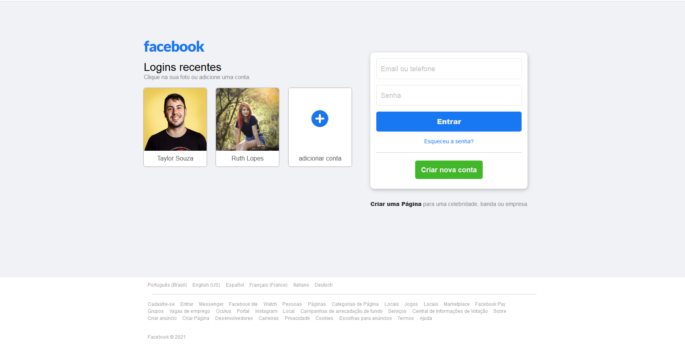

# Facebook-clone

## Meu primeiro projeto em HTML e CSS, após algumas aulas de HTML e CSS me desafiei a contruir um clone dda interface do Facebook e tive total êxito.

==================  

 ================== 

## Status: ✔️ Concluído.

- [x] HTML.
- [x] CSS.

 

## SCREENSHOT

