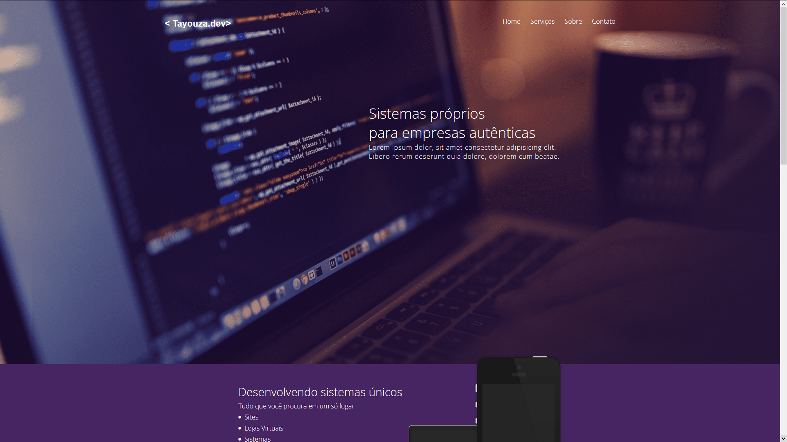
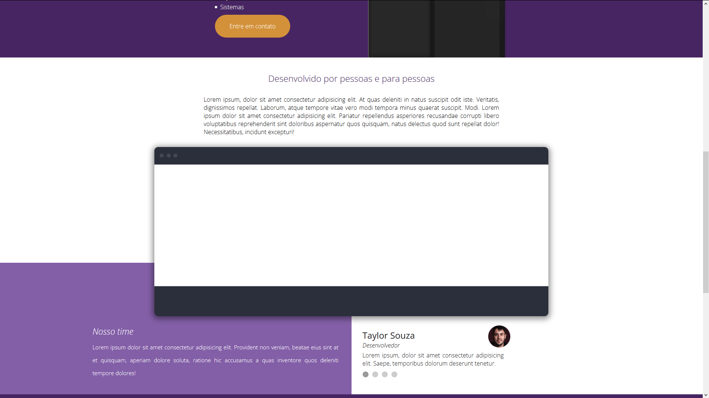
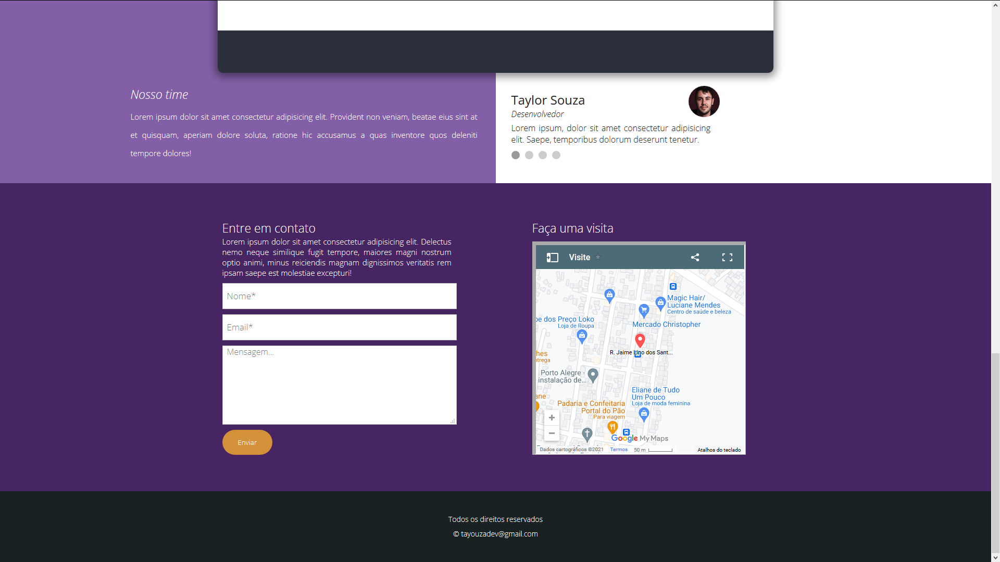
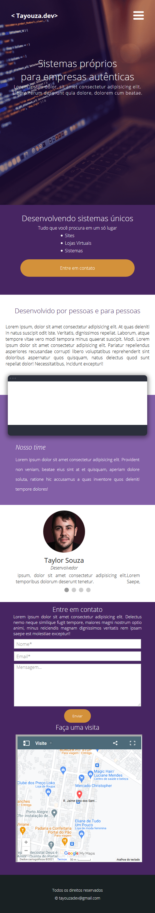

# LP Corporativa

## Desenvolvi essa Landing Page simples utilizando HTML, CSS e Js com jQuery, simples porém consegui implementar os codígos Js de maneira satisfatória.

## Status: ✔️ Concluído.

- [x] HTML.
- [x] CSS.
- [x] Js.
- [x] jQuery.

## SCREENSHOTS

